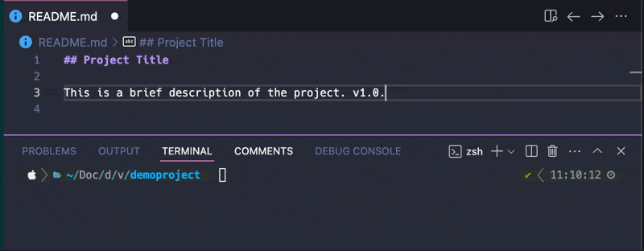
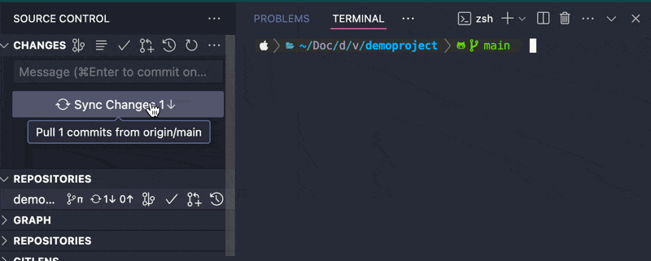
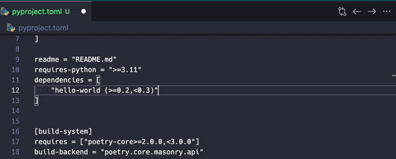

# TriggerMate - Automates tasks based on file updates

TriggerMate is a VSCode extension that watches for file changes and automatically executes predefined commands. This helps streamline workflows by ensuring necessary scripts run whenever critical files are updated.

## 🚀 Features

- 🔍 **Smart File Watching**: Automatically detect changes in your files and act instantly.
- ⚡ **Custom Command Execution**: Run your favorite scripts or commands seamlessly.
- 🛠️ **Task Integration**: Execute VSCode tasks directly as part of your automation workflow.
- 🎛️ **Event Control**: Fine-tune which events to monitor—creation, modification, or deletion.
- 📊 **Detailed Logs**: Stay informed with real-time logs of active watchers and triggered events.
- ⏱️ **Debounce Protection**: Avoid chaos with configurable delays to prevent rapid command execution.

TriggerMate makes your development workflow smarter, faster, and more efficient. 🚀

## 🎯 Use Cases

- Automatically run build scripts when source files change.
- Trigger deployment processes when configuration files are updated.
- Execute tests when test files are modified.
- Run linting or formatting commands when code files are saved.
- Perform database migrations when migration files are added or changed.

## ⚙️ Configuration Options

TriggerMate provides flexible configuration options to control its behavior. Below are the supported properties:

### `triggerMate.fileTriggers`

Defines the list of files to watch and commands to run.

#### Properties:

- **`file`** _(string, required)_ – The path to the file relative to the workspace. Supports glob patterns.
- **`command`** _(string, optional)_ – The command to execute when the file changes.
- **`autoExecute`** _(boolean, optional, default: false)_ – If `true`, the command runs automatically without prompting the user.
- **`commandType`** _(string, optional, default: "terminal")_ – Specifies whether to execute the command in a terminal or as a VSCode task. Options: `"terminal"`, `"task"`.
- **`ignoreCreateEvents`** _(boolean, optional, default: true)_ – If `true`, ignores file creation events.
- **`ignoreChangeEvents`** _(boolean, optional, default: false)_ – If `true`, ignores file change events.
- **`ignoreDeleteEvents`** _(boolean, optional, default: true)_ – If `true`, ignores file deletion events.
- **`commandDebounce`** _(number, optional, default: 0)_ – The number of milliseconds to wait before executing the next command for the same file.

#### Examples:

1️⃣ **Basic File Notification (No Command Execution)**

```json
{
  "triggerMate.fileTriggers": [{ "file": "README.md" }]
}
```

📌 _Triggers a notification when `README.md` changes._



2️⃣ **Prompted Command Execution**

```json
{
  "triggerMate.fileTriggers": [
    {
      "file": "package.json",
      "command": "npm install"
    }
  ]
}
```

📌 _Notifies the user and asks if they want to run `npm install` when `package.json` updates._



3️⃣ **Automatic Command Execution**

```json
{
  "triggerMate.fileTriggers": [
    {
      "file": "pyproject.toml",
      "command": "poetry install",
      "autoExecute": true
    }
  ]
}
```

📌 _Runs `poetry install` automatically when `pyproject.toml` changes._



4️⃣ **Glob Pattern Matching**

```json
{
  "triggerMate.fileTriggers": [
    {
      "file": "**/migrations/*.py",
      "command": "poetry run python manage.py migrate"
    }
  ]
}
```

📌 _Runs `poetry run python manage.py migrate` when any Python file in the `migrations` directory changes._

5️⃣ **Advanced Configuration with Debounce and Event Filtering**

```json
{
  "triggerMate.fileTriggers": [
    {
      "file": "**/*.js",
      "command": "eslint",
      "commandType": "task",
      "ignoreCreateEvents": true,
      "ignoreChangeEvents": false,
      "ignoreDeleteEvents": true,
      "commandDebounce": 500
    }
  ]
}
```

📌 _Runs `eslint` as a VSCode task when any JavaScript file changes, with a 500ms debounce to prevent rapid executions._

## 🛠️ How It Works

1. The extension detects changes in the specified files.
2. A notification prompts you to execute the associated command.
3. On confirmation, the command runs in a new terminal instance or as a VSCode task.

## 💡 Contributing

Want to improve TriggerMate? Feel free to open an issue or submit a pull request!

## 📜 License

MIT License. Free to use and modify.

---

TriggerMate – Your automation companion in VSCode! 🚀

Made with ❤️ by [Wust](https://wust.dev)
